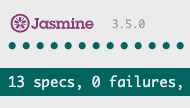

# [Curious World Website](https://camila-ribeiro.github.io/CuriousWorld-MilestoneProject/)

## Table of Contents
1. [**UX**](#ux)
    - [**User Stories**](#user-stories)
    - [**Design**](#design)
        - [**Libraries/Framework Used**](#Libraries/-framework-used)
        - [**Color Scheme**](#color-scheme)
        - [**Icons**](#icons)
        - [**Typography**](#typography)
    - [**Wireframes**](#wireframes)
        
2. [**Technologies Used**](#technologies-used)
    - [**Front-End Technologies**](#front-end-technologies)

3. [**Testing**](#testing)
    - [**Validators**](#validators)
    - [**Automated Testing**](#automated-testing)

4. [**Deployment**](#deployment)
    - [**Local Deployment**](#local-deployment)
    - [**Remote Deployment**](#remote-deployment)

5. [**Credits**](#credits)
    - [**Content**](#content)
    - [**Media**](#media)
    - [**Acknowledgements**](#acknowledgements)

***

 
## UX
Curious World is a website designed for users with interest in find out information about hotels, restaurants and museums across different cities all over the world. It offers photos, reviews, ratings, maps, websites and phone numbers.
The website is simple and structured in a way that is easy to navigate and find the information needed. It was designed based on database from Foursquare API.

 
### User Stories
- As a user I want to find out about hotels in London City, to perform this action I clicked on input where contains the message "Please type city's name (i.e Dublin)", then I selected the radio button "Hotels" and clicked on "search" button, doing that I achieved my goal to see a list of hotels in London.

- As a user I want to get inspiration about random places like hotels, restaurants and museums, then I clicked on place titles or images and got redirected to the Details page where I can find all the details about that selected place that I made on the homepage. My goal was accomplished and now I can read detailed information about the selected place such as full address, phone number, website, reviews, ratings and check the location on map.
 
- As a user I want to check the details about a specific hotel from the Search Results page, then I clicked on "Read More" button and got redirected to the Details page where I can find all the details about that selected hotel. My goal was accomplished and now I can read detailed information about the Hotel in London such as full address, phone number, website, reviews, ratings and check the location on map.
 
- As a user I want to contact Curous World website, to perform this action I clicked on "Contact Us" on the Menu Navigation and filled up the form with my full name, email address and message and submitted my query, doing that I achieve my goal to contact Curious World.

### Design

A standard layout is fully responsive on mobile devices and larger screens.

#### Libraries/ Framework Used
- [Bootstrap 4](https://getbootstrap.com/)
- [Google Maps](https://cloud.google.com/maps-platform/maps)
- [jQuery](https://jquery.com/download/)
- [Jasmine](https://jasmine.github.io/)
- [Jasmine - jQuery](https://github.com/velesin/jasmine-jquery)

#### Color Scheme

-  navbar
-  body background
-  yellow button
-  yellow star
-  white cards
-      loading gif

#### Icons

- [Font Awesome 5.13.0](https://fontawesome.com/)
    - 4 *Font Awesome* icons were used on hamburguer menu, rating stars, phone numbers and websites.
        - [bars](https://fontawesome.com/icons/bars?style=solid)
        - [star](https://fontawesome.com/icons/star?style=solid)
        - [phone](https://fontawesome.com/icons/phone?style=solid)
        - [globe](https://fontawesome.com/icons/globe-americas?style=solid)

#### Typography

- 2 [Google Fonts](https://fonts.google.com/) were used across the site:
    - [Lora](https://fonts.google.com/specimen/Lora) : main body text.
    - [Montserrat](https://fonts.google.com/specimen/Montserrat) : headings.

### Wireframes
My wireframes for this project can be found in the UX folder.
- [Desktop Wireframe] (https://camila-ribeiro.github.io/CuriousWorld-MilestoneProject/UX/desktop-wireframe/desktop.pdf)
- [Mobile Wireframe] (https://camila-ribeiro.github.io/CuriousWorld-MilestoneProject/UX/mobile-wireframe/mobile.pdf)

##### back to [top](#table-of-contents)
 
***

## Technologies Used

### Front-End Technologies
<b>Built with</b>
- 
    - [HTML5](https://developer.mozilla.org/en-US/docs/Web/Guide/HTML/HTML5) - Used as the base for markup text.
- 
    - [CSS3](https://developer.mozilla.org/en-US/docs/Web/CSS/CSS3) - Used as the base for cascading styles.
- 
    - [JavaScript ES6](https://developer.mozilla.org/en-US/docs/Web/JavaScript) - Used as the base for website interaction.
- 
    - [Jasmine](https://jasmine.github.io/) - Used for Test-Driven Development (TDD).
- 
    - [jasmine-jquery](https://www.npmjs.com/package/jasmine-jquery) - Used to simplify some of the automated Jasmine tests.

 
##### back to [top](#table-of-contents)
***

## Testing
Automated and manual testing were conducted during this project. I also have validated all files using online validation sites cited bellow and checked across differents browsers and devices.
I have tried automated test as much as possible but based on the fact that it is purely running entirely from the XHR itself I couldn't get more done. It is a feature left to implement later after I graduate from the course. I have conducted a detailed [manual testing] (testing/manual/testing.md) to show that I have testing done.

### Validators 

#### HTML
* [W3C HTML Validator](https://validator.w3.org/) - `Document checking completed. No errors or warnings to show.`

#### CSS
* [W3C CSS Validator](https://jigsaw.w3.org/css-validator/) - `Congratulations! No Error Found.`

#### JavaScript
* [JShint](https://jshint.com/)
    - File: [main.js](assets/js/main.js)
        - Metrics:
            - There are 23 functions in this file.
            - Function with the largest signature take 3 arguments, while the median is 0.
            - Largest function has 10 statements in it, while the median is 2.
            - The most complex function has a cyclomatic complexity value of 4 while the median is 1.
        - One unused variables
            - getURLVenuesId

    - File: [search.js](assets/js/search.js)    
        - Metrics:
            - There are 20 functions in this file.
            - Function with the largest signature take 2 arguments, while the median is 1.
            - Largest function has 12 statements in it, while the median is 4.5.
            - The most complex function has a cyclomatic complexity value of 11 while the median is 1.5.
        - Three warnings
            - Expected an assignment or function call and instead saw an expression.
            - Control character in string: .
            - Control character in string: .
        - Five unused variables
            - getURLVenuesId
            - handleClick
            - handlePagination
            - prevPage
            - nextPage

    - File: [details.js](assets/js/details.js)    
        - Metrics:
            - There are 12 functions in this file.
            - Function with the largest signature take 2 arguments, while the median is 1.
            - Largest function has 18 statements in it, while the median is 5.5.
            - The most complex function has a cyclomatic complexity value of 7 while the median is 2.

     - File: [contact.js](assets/js/contact.js)
        - Metrics:
            - There are 9 functions in this file.
            - Function with the largest signature take 2 arguments, while the median is 0.
            - Largest function has 8 statements in it, while the median is 2.
            - The most complex function has a cyclomatic complexity value of 2 while the median is 1.
        - Two undefined variables
            - `emailjs`
            - `response`
        - One unused variable
            - sendMail

    - File: [tests.js](testing/automated/scripts/tests.js)
        - Metrics:
            - There are 2 functions in this file.
            - Function with the largest signature take 0 arguments, while the median is 0.
            - Largest function has 8 statements in it, while the median is 6.5.
            - The most complex function has a cyclomatic complexity value of 3 while the median is 3.

### Manual Testing
More details can be found on my [manual testing folder] (testing/manual/)

I have also created a testing matrix ([raw Excel file here](testing/manual/curious_world-testing-milestone.xlsx)).

**Testing Matrix**

**Chrome's DevTools Audit Report**

| Performance | Accessibility | Best Practices | SEO | PWA |
| :---: | :---: | :---: | :---: | :---: |
| 98% | 100% | 100% | 91% | - |

### Automated Testing
I used [Jasmine 3.5.0](https://jasmine.github.io/) in conjunction with [jasmine-jquery 2.1.1](https://github.com/velesin/jasmine-jquery) to build all automated tests (test-driven development). These tests can be found in the [testing/automated(../blob/master/Testing.md) folder.

There are **13** tests in my specs, all successfully passing, with **0** failures.

<b>CLICK HERE</b> to see tests on the <b>Curious World website testing</b>

- describe: The Search Button
- describe: Get the values from radio buttons
- describe: Search input text inline validation

<b>CLICK HERE</b> to see tests on the <b>The Search Button</b>

- should exist
- should trigger click on Search button
- should clear session storage when click on Search button
- should get value from input radio when click on Search button
- should validate when value of input text is empty when click on Search button
- Session storage setItem when click on Search button
- should add keys/values to the session storage when click on Search button

<b>CLICK HERE</b> to see tests on the <b>Get the values from radio buttons</b>

- should exist
- radio button should be hotels value
- radio button should be restaurants value
- radio button should be museums value

<b>CLICK HERE</b> to see tests on the <b>Search input text inline validation</b>

- should exist
- should validate when value of input text is deleted by user
- should validate when value of input text has value typed by user

##### back to [top](#table-of-contents)

*** 
## Deployment

My [Curious World repository](https://github.com/Camila-Ribeiro/CuriousWorld-MilestoneProject) was developed locally using **VS Code**, and all commits were pushed to **GitHub** using **Git**.

This website was deployed on GitHub pages built from the Master branch to publish the project.
To run this project locally, download the files and navigate through the index.html to start.

### Local Deployment

To run this project locally on your own system, you will need to clone this repository and need to have [GIT](https://www.atlassian.com/git/tutorials/install-git) installed and any suitable IDE.

Next, to proceed with local deployment, you can...

- **Download** this GitHub repository
    - by clicking the green "*Clone or download*" button above,
    - select *Download Zip*,
    - this will download the project as a zip-file (*remember to unzip it first*).

### Remote Deployment

This site was deployed using [GitHub Pages](https://pages.github.com/) using the **master branch**.

Deployed Site:
- [https://camila-ribeiro.github.io/CuriousWorld-MilestoneProject/](https://camila-ribeiro.github.io/CuriousWorld-MilestoneProject/)

Once you have the project setup locally, you can proceed to deploy it remotely with the following steps:

1. Navigate to your GitHub repository:
    - `https://github.com/USERNAME/REPO`
2. Click on the **Settings** tab at the top:
    - `https://github.com/USERNAME/REPO/settings`
3. Scroll down on that page to the **GitHub Pages** section.
4. The first drop-down field should be **Source** with *None* preselected.
5. Select **master branch** from the list.
6. The page should refresh.
7. Scroll back down to the **GitHub Pages** section.
8. You should now have a deployed link:
    - `https://USERNAME.github.io/REPO`

**IMPORTANT NOTE**:
- Please allow a few minutes to pass before opening your newly deployed link! Clicking this link too quickly may result in a failure to build the site, causing an Error 404 page instead.

Congratulations! Your project should be deployed successfully on GitHub Pages! :tada: 

##### back to [top](#table-of-contents)

*** 
## Credits

### Content

- [Foursquare API](https://developer.foursquare.com/) - Database content
- [Travel Tim](https://github.com/TravelTimN/) - README.md inspiration
- [HTML5 Rocks](https://www.html5rocks.com/en/tutorials/cors/) - Using CORS for personal learning
- [Code Boxx](https://code-boxx.com/full-screen-css-loading-spinner/) - Loading spinner inspiration
- [Stack Overflow](https://stackoverflow.com/questions/42261524/how-to-window-scrollto-with-a-smooth-effect) - Smooth effect on page scroll
- [Stack Overflow](https://stackoverflow.com/questions/2532218/pick-random-property-from-a-javascript-object) - Pick random cities for Inspire Me section on homepage
- [Stack Overflow](https://stackoverflow.com/questions/18393981/append-vs-html-vs-innerhtml-performance) - Best performance to apply innerHTML
- [Github Jasmine](https://github.com/jasmine/jasmine/issues/299) - Reference for Jasmine testing using session storage

### Media

- [Foursquare API](https://developer.foursquare.com/) - Database images
- [LOADING.IO](https://loading.io/) - Animated icons
- [Unsplash](https://unsplash.com/) - Photo by Rana Sawalha on homepage
- [Unsplash](https://unsplash.com/) - Photo by Dino Reichmuth on contact page

### Acknowledgements
I received inspiration for this project from Code Institute - Project Ideas

##### back to [top](#table-of-contents)

 

 

 
 

